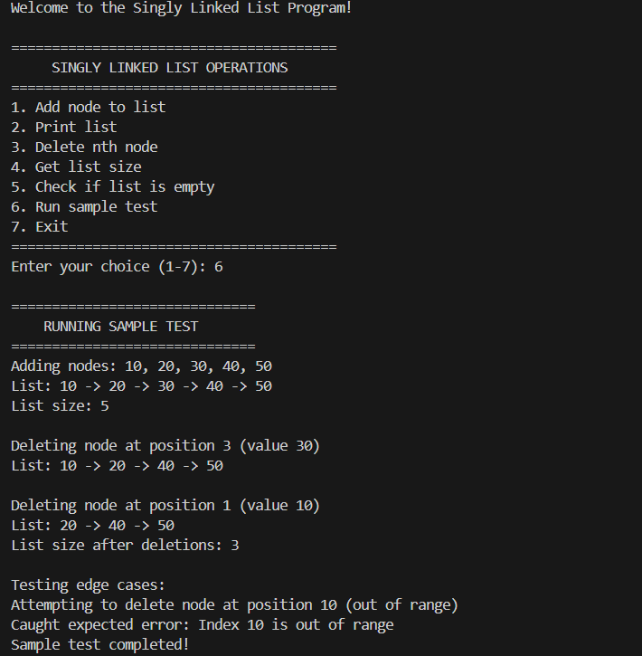

# Singly Linked List Implementation in Python

A comprehensive implementation of a singly linked list data structure using Object-Oriented Programming (OOP) principles in Python. This project demonstrates fundamental concepts of data structures, memory management, and user interaction through a clean, educational codebase.

## 🚀 Features

- **Complete OOP Implementation**: Well-structured classes with proper encapsulation
- **Interactive Menu System**: User-friendly command-line interface
- **Comprehensive Operations**: Add, delete, print, and utility functions
- **Robust Error Handling**: Custom exceptions for edge cases
- **Sample Testing**: Built-in test cases for demonstration
- **Educational Focus**: Clear code structure suitable for learning

## 📋 Table of Contents

- [Installation](#installation)
- [Usage](#usage)
- [Features Overview](#features-overview)
- [Class Structure](#class-structure)
- [Operations](#operations)
- [Sample Output](#sample-output)
- [Error Handling](#error-handling)

## 🛠️ Installation

1. **Clone the repository:**
   ```bash
   git clone https://github.com/yourusername/singly-linked-list-python.git
   cd singly-linked-list-python
   ```

2. **Requirements:**
   - Python 3.6 or higher
   - No external dependencies required

3. **Run the program:**
   ```bash
   python linked_list.py
   ```

## 🎯 Usage

Run the program and interact with the menu-driven interface:

```bash
python linked_list.py
```

The program will display an interactive menu with the following options:
1. Add node to list
2. Print list
3. Delete nth node
4. Get list size
5. Check if list is empty
6. Run sample test
7. Exit

## 📊 Features Overview

### Core Operations
- **Add Node**: Insert elements at the end of the list
- **Delete Node**: Remove elements by position (1-based indexing)
- **Print List**: Display all elements in a readable format
- **List Size**: Get the current number of nodes
- **Empty Check**: Verify if the list contains any elements

### Advanced Features
- **Custom Exception Handling**: Specialized error management
- **Input Validation**: Robust user input processing
- **Sample Testing**: Automated test cases with edge case handling
- **Mixed Data Types**: Support for integers, strings, and other data types

## 🏗️ Class Structure

### Node Class
```python
class Node:
    def __init__(self, data):
        self.data = data    # Store the data
        self.next = None    # Reference to next node
```

### LinkedList Class
```python
class LinkedList:
    def __init__(self):
        self.head = None    # Reference to first node
    
    # Core methods:
    # - add_node(data)
    # - delete_nth_node(n)
    # - print_list()
    # - get_size()
    # - is_empty()
```

### Custom Exception
```python
class LinkedListException(Exception):
    """Custom exception for linked list operations"""
    pass
```

## ⚡ Operations

| Operation | Time Complexity | Description |
|-----------|----------------|-------------|
| Add Node | O(n) | Traverse to end and insert |
| Delete Node | O(n) | Find position and remove |
| Print List | O(n) | Traverse and display all |
| Get Size | O(n) | Count all nodes |
| Is Empty | O(1) | Check if head is None |

## 📸 Sample Output

Below is a screenshot showing the program in action with sample operations:



*The image shows the interactive menu, sample test execution, and various operations being performed on the linked list.*

## 🛡️ Error Handling

The program includes comprehensive error handling for:

- **Empty List Operations**: Attempting to delete from an empty list
- **Index Out of Range**: Deleting nodes at invalid positions
- **Invalid Input**: Non-numeric input for position-based operations
- **Keyboard Interrupts**: Graceful exit on Ctrl+C

### Example Error Messages:
```
Error: Cannot delete from an empty list
Error: Index 10 is out of range
Error: Index must be greater than 0
```

## 🧪 Testing

The program includes a built-in sample test that demonstrates:

1. **Adding Multiple Nodes**: Inserts values [10, 20, 30, 40, 50]
2. **Deletion Operations**: Removes nodes at various positions
3. **Edge Case Testing**: Attempts invalid operations
4. **Size Tracking**: Shows list size before and after operations

Run the sample test by selecting option 6 from the main menu.


